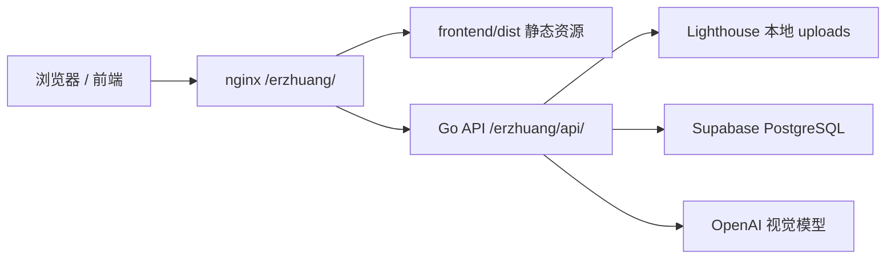

# 设计图标记与诊室区域管理技术方案

最后更新：2026-06-08

## 1. 方案结论

本项目在现有 `erzhuang-project` 上继续演进，不另建仓库。

技术栈：

- 前端：Vite + React + TypeScript。
- 后端：Go HTTP 服务。
- 数据库：Supabase PostgreSQL Shared Pooler。
- 文件存储：第一版使用 Lighthouse 本地磁盘。
- PDF 转图片：服务器端处理。
- AI 识别：后端调用视觉模型，返回结构化 JSON。
- 部署：沿用 GitHub + Lighthouse + systemd + nginx `/erzhuang/`。

核心原则：

- 前端不接触模型密钥、数据库连接串、云密钥。
- 后端统一承接文件上传、PDF 转换、AI 识别、数据保存。
- 主会话负责架构、发布、服务器配置、验收和回滚。
- 专项会话负责前端或后端实现，不直接操作服务器。

## 2. 目标架构



## 3. 分阶段实现

### Phase 1：后端数据模型和 CRUD

目标：

- 不做 PDF 和 AI。
- 先把门店、区域、日志的数据结构和 API 跑通。
- 前端可以用模拟图片和手工区域测试主流程。

交付：

- 数据库表。
- Store 层。
- API：
  - 门店列表。
  - 门店详情。
  - 创建门店。
  - 更新门店。
  - 删除门店。
  - 重复门店检查。
- 单元测试。

当前实现状态：

- 后端专项分支 `codex/design-plan-backend-phase1` 已完成 Phase 1 代码实现。
- 详细范围、验证记录和风险见 `docs/design-plan-backend-phase1-state.md`。
- 本阶段未实现 PDF、AI、OpenAI、部署配置和前端 UI。

### Phase 2：前端主交互

目标：

- 做出真实页面骨架和交互。
- 使用后端 CRUD。
- PDF/AI 可先用 mock 上传结果。

交付：

- 门店列表。
- 搜索和分页。
- 添加/编辑大弹窗。
- 右侧区域卡片。
- 左侧图片预览和矩形框编辑。
- 首页底部版本号。
- 图纸查看缩放。
- 类型色一致的选中高亮。
- 保存校验。
- 删除确认。

当前实现状态：

- 已完成页面骨架、真实 CRUD adapter、版本号展示、PDF 文件选择器入口、图纸查看缩放、类型色一致高亮。
- 上传/转换/AI 识别仍为 mock，等待 Phase 3/4。

### Phase 3：PDF 上传和图片转换

目标：

- 真实支持 PDF 上传。
- 服务器将 PDF 转为拼接 PNG 和缩略图。

交付：

- 上传接口。
- 文件校验：PDF、5MB、最多 5 页。
- PDF 转 PNG。
- 多页上下拼接。
- 文件保存到 `/opt/apps/erzhuang-project/uploads`。
- 前端 `handlePdfSelected` 需要从只传文件名升级为传 `File` 对象。
- 前端 `designPlanApi.uploadPdf` 需要从 mock adapter 升级为真实 multipart 上传。

### Phase 4：AI 识别

目标：

- 后端调用视觉模型识别门店名称和区域。
- 返回结构化识别结果。

交付：

- 识别接口。
- 模型 prompt。
- JSON schema。
- 识别结果落库。
- 识别失败/部分成功处理。

### Phase 5：上线验收和回滚演练

目标：

- 全链路上线。
- 用测试 PDF 验证。
- 保留回滚点。

交付：

- 发布记录。
- 验收记录。
- 回滚验证。

## 4. 数据库设计

### 4.1 stores

门店表。

```sql
create table stores (
  id bigserial primary key,
  name text not null,
  normalized_name text not null unique,
  original_pdf_path text not null,
  preview_image_path text not null,
  thumbnail_path text not null,
  page_count integer not null default 1,
  status text not null default 'completed',
  recognition_result jsonb,
  created_at timestamptz not null default now(),
  updated_at timestamptz not null default now()
);
```

状态：

- `completed`：已完成。
- `needs_review`：有低置信度区域。
- `incomplete`：异常/历史脏数据，正常保存不应出现。

### 4.2 store_areas

区域表。

```sql
create table store_areas (
  id bigserial primary key,
  store_id bigint not null references stores(id) on delete cascade,
  display_order integer not null,
  name text not null,
  area_type text not null,
  area_number integer,
  confidence text not null default 'high',
  needs_review boolean not null default false,
  box_x numeric not null,
  box_y numeric not null,
  box_width numeric not null,
  box_height numeric not null,
  created_at timestamptz not null default now(),
  updated_at timestamptz not null default now(),
  constraint store_areas_type_check check (area_type in ('treatment', 'consultation', 'beauty')),
  constraint store_areas_confidence_check check (confidence in ('high', 'medium', 'low')),
  constraint store_areas_box_check check (
    box_x >= 0 and box_x <= 1 and
    box_y >= 0 and box_y <= 1 and
    box_width > 0 and box_width <= 1 and
    box_height > 0 and box_height <= 1 and
    box_x + box_width <= 1 and
    box_y + box_height <= 1
  )
);
```

编号唯一：

```sql
create unique index store_areas_unique_number_per_type
on store_areas (store_id, area_type, area_number)
where area_number is not null;
```

业务含义：

- `treatment`：治疗室。
- `consultation`：面诊室。
- `beauty`：生美。

### 4.3 operation_logs

全局操作日志。

```sql
create table operation_logs (
  id bigserial primary key,
  action text not null,
  store_id bigint,
  store_name text not null,
  actor text not null default 'admin',
  summary text not null,
  created_at timestamptz not null default now()
);
```

操作类型：

- `create`
- `update`
- `delete`
- `replace`

## 5. 文件存储

第一版保存到服务器本地磁盘：

```text
/opt/apps/erzhuang-project/uploads
```

目录建议：

```text
uploads/
  stores/
    <store-id-or-temp-id>/
      original.pdf
      preview.png
      thumbnail.png
```

说明：

- 数据库只保存相对路径或受控路径。
- nginx 不直接开放整个 uploads 目录。
- 图片通过 Go 后端受控接口读取，避免路径穿越。
- 删除门店时删除对应文件；删除失败记录日志，不阻断删除。

后续可迁移到 Supabase Storage 或对象存储。

## 6. PDF 处理方案

推荐后端使用系统工具完成 PDF 转 PNG。

服务器依赖：

- `poppler-utils`
- 可使用 `pdftoppm` 或 `pdfinfo`

流程：

1. 校验文件类型和大小。
2. 使用 `pdfinfo` 获取页数。
3. 页数超过 5 返回错误。
4. 使用 `pdftoppm` 转每页 PNG。
5. 多页按页码上下拼接。
6. 生成缩略图。
7. 保存到 uploads。

拼接方案：

- Go 可用 `image/png` 和 `image/draw` 完成上下拼接。
- 缩略图可用 Go 图片库缩放。

## 7. AI 识别方案

### 7.1 模型选择

后端调用支持视觉输入和结构化输出的 OpenAI 模型。

建议：

- 默认使用当前主力多模态模型。
- 后端通过环境变量配置模型名，例如 `OPENAI_MODEL`。
- 不把模型名写死在业务逻辑中。

环境变量：

```text
OPENAI_API_KEY=...
OPENAI_MODEL=...
```

说明：

- 密钥只放服务器环境文件。
- 前端不接触密钥。
- 技术方案保留模型替换能力。

### 7.2 输入

识别接口使用拼接后的 PNG。

输入给模型：

- 图纸图片。
- 任务说明。
- 区域类型定义。
- 输出 JSON schema。

识别目标：

- 门店名称。
- 治疗室。
- 面诊室。
- 生美。

忽略：

- 前台。
- 走廊。
- 仓库。
- 洗手间。
- 办公区。
- 非目标空间。

### 7.3 输出 JSON

```json
{
  "store_name": "xxx门店",
  "store_name_confidence": "high",
  "areas": [
    {
      "name": "治疗室1",
      "type": "treatment",
      "number": 1,
      "confidence": "high",
      "box": {
        "x": 0.12,
        "y": 0.33,
        "width": 0.08,
        "height": 0.06
      }
    }
  ],
  "raw_notes": "识别备注"
}
```

坐标：

- 使用 0 到 1 的比例坐标。
- 基于拼接 PNG 原图。

置信度：

- `high`
- `medium`
- `low`

低置信度：

- 标记 `needs_review=true`。
- 前端展示“需确认”。
- 不阻止保存。

### 7.4 识别接口设计

建议识别分两步：

1. 上传 PDF 并转换图片。
2. 调用识别接口识别已上传图纸。

好处：

- PDF 失败和 AI 失败可独立处理。
- 前端能先展示图纸。
- 后续可重新识别。

## 8. API 设计

所有业务 API 挂在：

```text
/api/design-plan
```

nginx 公网路径对应：

```text
/erzhuang/api/design-plan
```

### 8.1 门店列表

```http
GET /api/design-plan/stores?q=&page=1&page_size=20
```

返回：

```json
{
  "items": [
    {
      "id": 1,
      "name": "杭州西湖店",
      "thumbnail_url": "/api/design-plan/stores/1/thumbnail",
      "treatment_count": 2,
      "consultation_count": 3,
      "beauty_count": 1,
      "area_count": 6,
      "status": "completed",
      "updated_at": "2026-06-05T00:00:00Z"
    }
  ],
  "page": 1,
  "page_size": 20,
  "total": 1
}
```

### 8.2 门店详情

```http
GET /api/design-plan/stores/{id}
```

返回门店、图片 URL、区域列表。

### 8.3 上传 PDF

```http
POST /api/design-plan/uploads
Content-Type: multipart/form-data
```

返回：

```json
{
  "upload_id": "tmp_xxx",
  "file_name": "floor.pdf",
  "page_count": 1,
  "preview_url": "/api/design-plan/uploads/tmp_xxx/preview",
  "thumbnail_url": "/api/design-plan/uploads/tmp_xxx/thumbnail"
}
```

### 8.4 AI 识别

```http
POST /api/design-plan/uploads/{upload_id}/recognize
```

返回识别结果和疑似重复门店。

### 8.5 创建门店

```http
POST /api/design-plan/stores
```

保存 upload、门店名、区域列表。

### 8.6 更新门店

```http
PUT /api/design-plan/stores/{id}
```

支持更新门店名称、区域、排序、框坐标。

如果传入新的 upload，则覆盖 PDF、图片和区域。

### 8.7 删除门店

```http
DELETE /api/design-plan/stores/{id}
```

彻底删除门店、区域、文件和识别结果，保留全局删除日志。

### 8.8 重复检查

```http
POST /api/design-plan/stores/check-duplicate
```

请求：

```json
{
  "name": "杭州西湖店",
  "exclude_store_id": 1
}
```

返回：

```json
{
  "exact_match": null,
  "similar_matches": []
}
```

## 9. 后端模块划分

建议新增包：

```text
internal/designplan/
  handler.go
  service.go
  store.go
  models.go
  validation.go
  files.go
  pdf.go
  recognizer.go
  recognizer_openai.go
  duplicate.go
```

职责：

- `handler.go`：HTTP 入参和响应。
- `service.go`：业务流程编排。
- `store.go`：数据库读写。
- `models.go`：领域模型。
- `validation.go`：保存校验。
- `files.go`：文件路径和读写。
- `pdf.go`：PDF 转换。
- `recognizer.go`：识别接口抽象。
- `recognizer_openai.go`：OpenAI 实现。
- `duplicate.go`：同名/模糊匹配。

## 10. 前端模块划分

建议目录：

```text
frontend/src/features/designPlan/
  api.ts
  types.ts
  DesignPlanPage.tsx
  StoreList.tsx
  StoreEditorModal.tsx
  FloorPlanCanvas.tsx
  AreaCardList.tsx
  DuplicateStoreDialog.tsx
  DeleteStoreDialog.tsx
  validation.ts
```

职责：

- `DesignPlanPage`：页面容器。
- `StoreList`：列表、搜索、分页、缩略图 hover。
- `StoreEditorModal`：添加/编辑大弹窗。
- `FloorPlanCanvas`：图纸预览、缩放、画框、拖动、拉伸。
- `AreaCardList`：右侧区域卡片。
- `DuplicateStoreDialog`：同名/疑似同名确认。
- `DeleteStoreDialog`：删除确认。
- `api.ts`：后端 API 调用。
- `validation.ts`：前端即时校验。

### 10.1 UI 风格和设计变量

第一版没有独立 UI 设计稿，前端按主流大厂后台系统风格实现：

- 简洁。
- 大气。
- 克制。
- 专业。
- 高信息密度但不拥挤。
- 重点突出业务状态、图纸和区域维护效率。

避免：

- 营销化 hero。
- 过度装饰。
- 大面积单一色系。
- 颜色散落在组件内。

建议在前端集中定义设计变量，例如：

```css
:root {
  --color-bg: #f6f8fb;
  --color-surface: #ffffff;
  --color-border: #d9e2ef;
  --color-text: #18212f;
  --color-muted: #667085;
  --color-primary: #2563eb;
  --color-danger: #c2410c;
  --color-warning: #b7791f;
  --color-success: #15803d;
  --area-treatment: #d94841;
  --area-consultation: #2f6fdb;
  --area-beauty: #2f9e66;
  --area-selected: #facc15;
}
```

后续如调整品牌色或区域颜色，只改设计变量，不改业务组件。

## 11. 发布和环境配置

新增服务器环境变量：

```text
OPENAI_API_KEY=...
OPENAI_MODEL=...
UPLOAD_DIR=/opt/apps/erzhuang-project/uploads
```

保留：

```text
DATABASE_URL=...
```

systemd 环境文件：

```text
/etc/erzhuang-project.env
```

注意：

- 不提交密钥。
- 不在前端构建产物中暴露密钥。
- 发布脚本需要确保 uploads 目录存在且 `lighthouse` 用户可写。
- 服务器需要安装 PDF 处理依赖。

## 12. 风险和应对

### 12.1 AI 框选精度

风险：

- 设计图复杂，模型框选可能不准。

应对：

- P0 保留人工拖动和拉伸。
- 精度目标约 80%。
- 低置信度标记“需确认”。

### 12.2 PDF 处理依赖

风险：

- 服务器缺少 `poppler-utils`。

应对：

- 部署前安装依赖。
- 发布记录中记录依赖版本。
- PDF 转换失败可提示重传。

### 12.3 本地文件存储

风险：

- 单机磁盘存储不适合长期扩展。

应对：

- 第一版作为练习项目接受。
- 后续迁移 Supabase Storage 或对象存储。

### 12.4 大图性能

风险：

- 拼接图过长、浏览器画框卡顿。

应对：

- 限制 5MB、5 页。
- 缩略图和预览图分开。
- 前端画框使用比例坐标。

### 12.5 删除不可恢复

风险：

- 门店删除为彻底删除。

应对：

- 二次确认。
- 保留全局删除日志。

## 13. 分工

### 主会话：架构/交付中枢

负责：

- 最终技术方案。
- 分支和专项会话调度。
- 代码 review 和合并。
- Tencent Cloud / TAT / systemd / nginx。
- 服务器依赖安装。
- 环境变量配置。
- 发布、验证、回滚。

### 后端专项会话

负责：

- Go 数据模型和 API。
- PostgreSQL schema。
- Store 层。
- PDF 上传和转换。
- AI 识别接口。
- 后端测试。

不负责：

- 云密钥。
- 服务器操作。
- nginx/systemd。

### 前端专项会话

负责：

- React 页面。
- 门店列表。
- 大弹窗。
- 区域卡片。
- 图纸画框交互。
- API 对接。
- 前端构建验证。

不负责：

- OpenAI 密钥。
- 数据库密钥。
- 服务器操作。

## 14. 推荐执行顺序

1. 创建后端专项会话：实现 Phase 1 数据模型和 CRUD。
2. 创建前端专项会话：基于 mock API/接口约定实现页面骨架。
3. 主会话 review 两边接口契约。
4. 后端继续 Phase 3 PDF 上传转换。
5. 前端接真实上传和图片预览。
6. 后端实现 Phase 4 AI 识别。
7. 前端接真实识别结果。
8. 主会话集成验收。
9. 主会话发布到 Lighthouse。
10. 主会话记录发布和回滚点。

## 15. 当前决策

- 需要新建后端专项会话。
- 复用现有前端专项协作模式，但建议为本需求新建前端专项会话或重命名现有前端会话，避免和“技术栈搭建”历史混在一起。
- 第一阶段不直接碰服务器，先完成本地代码和接口契约。
- AI 识别使用后端受控接口，前端不直连模型。
