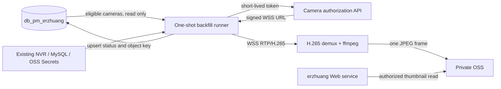

# NVR Snapshot One-Time Backfill Design

> **Superseded on 2026-08-26.** This document describes the discarded
> database-table approach. The active, no-DBA design is
> `2026-08-26-nvr-snapshot-backfill-oss-design.md`.

**Date:** 2026-08-26

## Goal

Generate one default thumbnail for every eligible NVR camera without adding a user-facing maintenance flow, a scheduled refresh service, or configuration to the running erzhuang-project Web instance.

The work is a one-time backend data backfill. The first run targets test-store `10001`; a full test-environment run and a separate production run require explicit approval after the preceding stage is accepted.

## Non-goals

- No recurring capture, refresh scheduler, admin screen, camera-page button, or browser-resident queue.
- No writes to synchronized business tables `tb_crm_*`.
- No changes to the live/replay monitor experience beyond showing an available stored thumbnail.
- No image history. Each camera has at most one current thumbnail.
- No new environment variables or packages in the running Web instance.

## Eligibility And Data Ownership

The runner processes only cameras satisfying the existing NVR access rule:

```sql
category = 'camera'
and provider = 'HikVisionNvrChannel'
and status = 1
and deleted_at is null
```

It reads the synchronized resource tables in `db_pm_erzhuang` and writes only to two owned resources:

1. Private OSS object key: `nvr-camera-snapshots/{tenant_id}/{camera_id}.jpg`.
2. A new erzhuang MySQL table `tb_nvr_camera_snapshots`.

The table holds one row per `(tenant_id, camera_id)`:

| Field | Purpose |
| --- | --- |
| `id` | Primary key. |
| `tenant_id`, `camera_id` | Business-camera identity; unique together. |
| `status` | `succeeded` or a terminal failure state. |
| `object_key`, `content_type` | Private OSS reference, never a signed URL. |
| `width`, `height`, `byte_size` | Output validation and diagnostics. |
| `captured_at`, `attempted_at` | Capture and most recent processing time. |
| `error_code` | Stable classified failure code only; no token, WSS URL, or raw upstream response. |
| `created_at`, `updated_at` | Audit timestamps. |

The runner skips existing `succeeded` rows by default. A later explicit invocation resumes all rows without a successful snapshot, including terminal failures; no automatic retry loop or scheduled operation exists.

## Architecture



### Runner

The runner is a dedicated command, packaged as a separate one-shot container image. It is run as an ephemeral K8s Job or company CI manual stage, not as a deployment of the Web application.

- It receives existing Secret references through the temporary Job manifest. The Web instance gains no variables, packages, sidecars, or changed entrypoint.
- It reuses the server-side NVR authorization protocol, so a user browser, SSO cookie, or frontend API is not required.
- It connects one camera at a time. The next camera starts only after the previous WSS connection, parser, decoder, and ffmpeg process are closed.
- The runner uses a backend H.265/RTP demuxer based on the verified NVRPlayer packet format, writes a short Annex-B H.265 stream to ffmpeg, and accepts the first decodable JPEG.
- A camera has a 20-second end-to-end deadline. Any failure is classified, persisted, and processing continues.

The JPEG is resized to a maximum long edge of `640` pixels at quality `80`; an output larger than `1 MiB` is rejected. Failure codes are limited to `authorization_failed`, `wss_connect_failed`, `wss_connect_timeout`, `media_timeout`, `demux_failed`, `decode_failed`, `thumbnail_invalid`, `oss_upload_failed`, and `database_write_failed`.

This is intentionally not implemented with headless Chromium. The supplied SDK proves the stream format and Canvas behaviour, but its live path depends on browser WebCodecs H.265 support. A native backend demuxer plus ffmpeg is more appropriate for a server-side, one-time data operation.

### Thumbnail Read Path

The existing NVR camera-list API resolves thumbnail sources in this order:

1. Current `tb_nvr_camera_snapshots` success row.
2. Existing safe legacy screenshot fallback, limited to one-recorder and same-channel matches.
3. No URL, which the frontend renders as the neutral placeholder.

`GET /api/h5/nvr-monitor/orgs/{externalOrgId}/cameras/{cameraId}/thumbnail` checks the same `monitor:view` store scope as video access before reading the private OSS object. It sends no signed OSS URL to the client and never exposes NVR credentials.

## One-Time Execution Stages

1. **Technical spike, test `10001`:** run a single camera already verified for live playback. Success requires a valid JPEG in private OSS, a `succeeded` row, and authorized UI display. This stage validates the unknown server-side H.265/ffmpeg compatibility before any batch operation.
2. **Test-store batch:** sequentially process all eligible cameras in `10001`, producing a job summary: selected, succeeded, failed by stable code, skipped.
3. **Full test batch:** explicit approval; process all eligible test cameras sequentially.
4. **Production backfill:** separate approval, separate Job invocation, and production Secret references. It never reuses a test object prefix or database connection.

The Job exits after its requested stage. It does not run periodically and does not continue in the background after the Pod exits.

## Safety And Failure Behaviour

- Long NVR authorization, signed WSS URLs, image bytes, and upstream error bodies are not written to logs, MySQL error columns, browser responses, or source control.
- OSS objects remain private. API reads are gated by store scope.
- The runner writes an image only after validating JPEG content type, non-zero dimensions, and a maximum output size. It resizes to a bounded thumbnail before upload.
- Failure of one camera cannot abort the queue. The final command result includes aggregate counts and non-sensitive failure codes.
- The default invocation does not overwrite existing successful snapshots.
- If the runner is killed, completed rows are durable. A later explicit invocation resumes by selecting rows without successful snapshots.
- Rollback is deletion of the temporary Job/image and removal of the thumbnail read preference; no business data is changed. Existing Web-instance monitor playback remains independent.

## Operations And DDL

Before implementation, the DBA/operations path must approve the table DDL for both test and production. The runner image and one-shot Job manifest are separate from the normal Wharf application instance configuration.

The operator invocation must be explicit and scoped, for example:

```text
scope: tenant=10001
mode: missing-only
concurrency: 1
timeout-per-camera: 20s
```

No permanent CronJob, automatic trigger, Web UI action, or instance-level configuration is introduced.

## Acceptance Criteria

- A test `10001` sample camera produces a readable JPEG through the backend-only stream path.
- The runner never has more than one active WSS capture.
- A successful record appears in `tb_nvr_camera_snapshots`; business `tb_crm_*` tables remain unchanged.
- An authorized NVR monitor list displays the stored thumbnail; an unauthorized user cannot retrieve it.
- A failed camera records only a stable error code and does not stop later queue items.
- The temporary Job terminates after the requested scope completes.
- No NVR credential, signed WSS URL, or image content appears in command logs or application logs.
